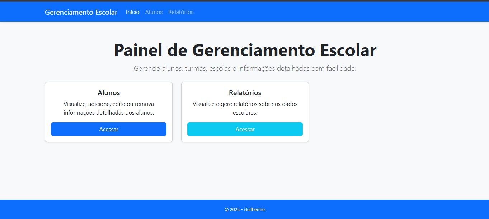
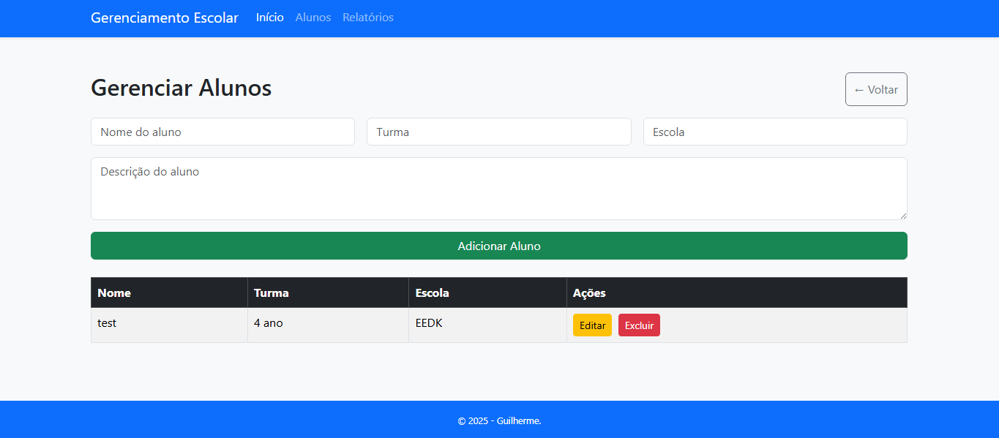
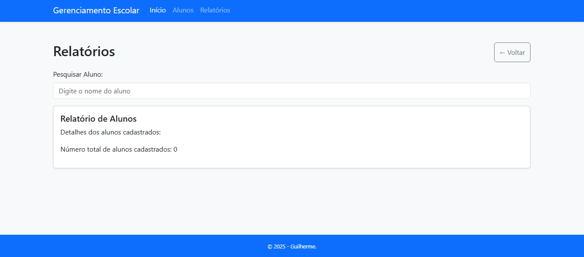

# Gerenciamento Escolar - Premium

Este é um sistema web simples para gerenciar informações de alunos, desenvolvido utilizando HTML, CSS (Bootstrap) e Javascript. Ele permite adicionar, visualizar, editar e remover alunos, além de oferecer uma tela de relatório para pesquisar e visualizar os dados dos alunos.

## Telas e Funcionalidades

A aplicação é dividida em três seções principais, acessíveis através da barra de navegação no topo:

### 1. Início (Home)

A tela inicial oferece uma visão geral do sistema e acesso rápido às principais funcionalidades através de cartões informativos.

* **Título:** "Painel de Gerenciamento Escolar"
* **Descrição:** Uma breve descrição do propósito da aplicação.
* **Cartão de Alunos:** Informa sobre a funcionalidade de gerenciamento de alunos (visualizar, adicionar, editar, remover) e possui um botão "Acessar" para a seção de Alunos.
* **Cartão de Relatórios:** Informa sobre a funcionalidade de relatórios (visualizar e gerar) e possui um botão "Acessar" para a seção de Relatórios.
* **(Futuras Funcionalidades):** Espaço para adicionar cartões para outras seções como "Turmas" ou "Escolas", caso sejam implementadas.

### 2. Alunos (Students)

A seção de Alunos é onde você pode gerenciar a lista de alunos.

* **Título:** "Gerenciar Alunos"
* **Botão "← Voltar":** Retorna à tela inicial.
* **Formulário de Adição de Aluno:** Permite adicionar novos alunos ao sistema.
    * **Nome do aluno:** Campo de texto obrigatório para o nome do aluno.
    * **Turma:** Campo de texto para a turma do aluno.
    * **Escola:** Campo de texto para a escola do aluno.
    * **Descrição do aluno:** Área de texto para adicionar uma descrição sobre o aluno.
    * **Botão "Adicionar Aluno":** Salva as informações do novo aluno.
* **Tabela de Alunos:** Exibe a lista de alunos cadastrados.
    * **Cabeçalho:** Nome, Turma, Escola, Ações.
    * **Linhas:** Cada linha representa um aluno e exibe suas informações.
    * **Botão "Editar":** Abre um modal para editar as informações do aluno na linha correspondente.
    * **Botão "Excluir":** Remove o aluno da lista após confirmação.
* **Modal de Edição de Aluno:** Uma janela pop-up para editar os detalhes de um aluno existente.
    * **Título:** "Editar Aluno"
    * **Formulário de Edição:** Contém campos para Nome, Turma, Escola e Descrição, preenchidos com os dados do aluno selecionado.
    * **Botão "Salvar":** Salva as alterações feitas no aluno.
    * **Botão "Fechar":** Fecha o modal sem salvar as alterações.

### 3. Relatórios (Reports)

A seção de Relatórios permite pesquisar e visualizar informações sobre os alunos.

* **Título:** "Relatórios"
* **Botão "← Voltar":** Retorna à tela inicial.
* **Área de Pesquisa de Aluno:** Permite pesquisar alunos por nome.
    * **Label "Pesquisar Aluno:":** Rótulo para o campo de busca.
    * **Campo de texto:** O usuário digita o nome do aluno que deseja encontrar.
    * **Funcionalidade:** Ao digitar, os resultados são filtrados e exibidos abaixo. Se o campo estiver vazio, todos os alunos cadastrados são exibidos.
* **Relatório de Alunos:** Exibe os detalhes dos alunos.
    * **Título:** "Relatório de Alunos"
    * **Descrição:** Uma breve descrição do que é exibido nesta seção.
    * **Área de Detalhes do Aluno (`studentReportDetails`):** Exibe os detalhes de cada aluno (Nome, Turma, Escola, Descrição) em um formato de cartão. Se uma pesquisa for realizada, apenas os alunos correspondentes serão mostrados. Inicialmente, todos os alunos são listados.
    * **Número total de alunos cadastrados:** Exibe a quantidade total de alunos no sistema.

## Como Utilizar

1.  Abra o arquivo HTML em seu navegador web.
2.  **Início:** Navegue pelos cartões para acessar as seções desejadas.
3.  **Alunos:**
    * Para adicionar um novo aluno, preencha o formulário e clique em "Adicionar Aluno".
    * Para editar um aluno, clique no botão "Editar" na linha do aluno desejado, faça as alterações no modal e clique em "Salvar".
    * Para excluir um aluno, clique no botão "Excluir" na linha do aluno desejado e confirme a ação.
4.  **Relatórios:**
    * Ao acessar a tela, todos os alunos cadastrados serão exibidos.
    * Para pesquisar um aluno específico, digite o nome no campo "Pesquisar Aluno". Os resultados serão atualizados conforme você digita. Deixe o campo vazio para visualizar todos os alunos novamente.

## Observações

* Os dados dos alunos são armazenados localmente no navegador utilizando o Local Storage. Isso significa que os dados serão mantidos mesmo após o fechamento do navegador, mas serão específicos para o navegador e computador utilizados.
* Para adicionar as imagens das telas, crie uma pasta chamada `screenshots` no mesmo diretório do arquivo HTML e salve as imagens com os nomes `home.png`, `alunos.png` e `relatorios.png`. Em seguida, atualize os caminhos `` com o caminho correto das suas imagens, se necessário.

## Melhorias Futuras

* Implementação de funcionalidades para gerenciar turmas e escolas como entidades separadas.
* Opções de filtragem e ordenação na tabela de alunos.
* Funcionalidades mais avançadas de relatório, como geração de relatórios em PDF ou CSV.
* Validação de dados mais robusta nos formulários.
* Implementação de um backend para persistência de dados mais segura e compartilhada entre usuários.